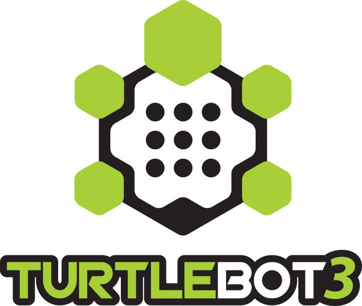

# Multi-Agent Source Term Localization with Turtlebot3

|  | |
| :-------------------------------------:|:----------------------------------------------:|

 
 This repository is a ROS package to setup multi-agent source term localization using multiple Turtlebot3- burger platforms. This ROS package is developed for Noetic Distribution with a Ubuntu 20.04 OS. In future, appropriate ROS packages for different distributions may be released. The status of the Noetic branch can be found here:
 
[noetic-devel Status](https://github.com/LU-Centre-for-Autonomous-Systems/tbot3_gas_sensing/edit/noetic-devel)

# TURTLEBOT3 Resources for assembly and setup

### ROBOTIS e-Manual for TurtleBot3
- [ROBOTIS e-Manual for TurtleBot3](http://turtlebot3.robotis.com/)

### Open Source related to TurtleBot3
- [turtlebot3](https://github.com/ROBOTIS-GIT/turtlebot3)
- [turtlebot3_msgs](https://github.com/ROBOTIS-GIT/turtlebot3_msgs)

### Documents and Videos related to TurtleBot3
- [ROBOTIS e-Manual for TurtleBot3](http://turtlebot3.robotis.com/)

Using the above documentation, assemble the turtlebot3 and replace the LDS-01(2) sensor with an RP-lidar sensors using its appropriate SLAMTEC controller.

# PACKAGE and Dependencies Installation

In order to install the ROS package for gas sensing using a turtlebot3 equipped with a COZIR-A gas sensor and RP-Lidar (A2 or A3), follow the following steps:
	
1. Configure the COZIR-A sensors using the directions [here](https://github.com/LU-Centre-for-Autonomous-Systems/ros-cozir-co2sensor).

2. Change directory to the `src` folder in your catkin workspace `catkin_ws`

3.  Clone the ROS package to interface and publish the COZIR-AH sensor
	```
	git clone https://github.com/LU-Centre-for-Autonomous-Systems/ros-cozir-co2sensor.git
	```

4. Clone the RP-LIDAR package using the following 
	```
	git clone https://github.com/Slamtec/rplidar_ros.git
	```

5.  Clone the tbot3-gas-sensing package
	```
	git clone -b noetic-devel https://github.com/LU-Centre-for-Autonomous-Systems/tbot3_gas_sensing.git
	```

6. Return to the root `catkin_ws` folder and '`catkin_make` the cloned ROS packages

# Configuring the Environment Variables
In order to run the scripts/launch files from the previously cloned ROS packages, certain environment variables about the RP-Lidar and the Turtlebots are required to be added to your `.bashrc` script.

1. open the `.bashrc` script
	```
	nano ~/.bashrc
	```

2. add the following lines to the end of the script
	```
	export TURTLEBOT3_MODEL=<burger or waffle>
	export rplidar_baudrate= <baudrate-of-rplidar-model>
	export bot_ns=<add-turtlebot-namespace>
	```
	where `baudrate` is 115200 for RP-Lidar model A2M6 or A2M8 and 256000 for model A2M7 or A3, and `bot_ns` is the name the desired namespace associate with the Turtlebot3. Note that this name space is used in all the launch files associate with this ROS package, both for name spacing topics and the TF tree. For scenarios with no namespace, simply comment out the line exporting the `bot_ns` environmental variable and source your `~/.bashrc` before running the launch files.

# User Instructions


